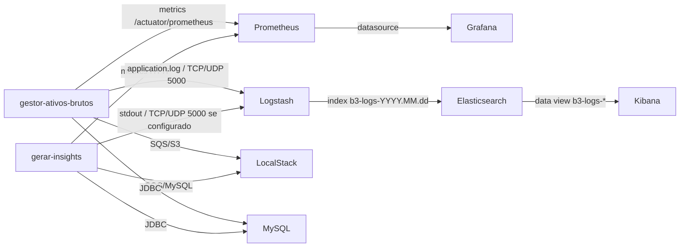

# Guia de Observabilidade do Ecossistema B3

Este documento descreve a stack de observabilidade declarada no `docker-compose.yml`, com foco nas configuracoes de logs, metricas, portas expostas, integracoes entre servicos e formas de acesso local.

## Visao Geral

A infraestrutura de observabilidade e composta por:

| Servico | Funcao | Porta local |
| --- | --- | --- |
| Logstash | Recebimento, parse e envio de logs | `5000/tcp`, `5000/udp` |
| Elasticsearch | Armazenamento e indexacao de logs | `9200` |
| Kibana | Consulta e visualizacao de logs | `5601` |
| Prometheus | Coleta e armazenamento de metricas | `9090` |
| Grafana | Dashboards e visualizacao de metricas | `3000` |

A stack tambem se integra com os servicos de negocio:

| Servico | Funcao | Porta local |
| --- | --- | --- |
| `gestor-ativos-brutos` | API Java/Spring Boot | `8091` |
| `gerar-insights` | Servico Python de geracao de insights | `8080` |
| `mysql` | Banco relacional | `3305` |
| `localstack` | SQS/S3 local | `4566` |

## Arquitetura de Integracao



## Endpoints Locais

Com os containers em execucao, os principais acessos locais sao:

| Servico | URL / Host | Credenciais / Observacao |
| --- | --- | --- |
| Gestor Ativos Brutos | `http://localhost:8091` | API Java |
| Actuator Health | `http://localhost:8091/actuator/health` | Saude da API Java |
| Actuator Prometheus | `http://localhost:8091/actuator/prometheus` | Metricas da API Java |
| Gerar Insights | `http://localhost:8080` | Servico Python |
| Grafana | `http://localhost:3000` | `admin/admin` |
| Prometheus | `http://localhost:9090` | UI de metricas |
| Prometheus Targets | `http://localhost:9090/targets` | Status dos scrapes |
| Kibana | `http://localhost:5601` | UI de logs |
| Elasticsearch | `http://localhost:9200` | API REST |
| Elasticsearch Health | `http://localhost:9200/_cluster/health` | Saude do cluster |
| LocalStack | `http://localhost:4566` | SQS/S3 local |
| LocalStack Health | `http://localhost:4566/_localstack/health` | Saude LocalStack |
| MySQL | `localhost:3305` | `spring/spring123`, database `minha_base` |
| Logstash TCP/UDP | `localhost:5000` | Entrada de logs JSON |

## Configuracao do Logstash

Arquivo:

```text
logstash.conf
```

Configuracao atual:

```conf
input {
  tcp {
    port => 5000
    codec => json_lines
  }

  udp {
    port => 5000
    codec => json_lines
  }
}

filter {
}

output {
  elasticsearch {
    hosts => ["http://elasticsearch:9200"]
    index => "b3-logs-%{+YYYY.MM.dd}"
  }

  stdout {
    codec => rubydebug
  }
}
```

### Bloco `input`

O Logstash recebe eventos por dois protocolos:

```conf
tcp {
  port => 5000
  codec => json_lines
}
```

Recebe logs via TCP na porta `5000`. O codec `json_lines` espera um JSON por linha. Exemplo de payload valido:

```json
{"service":"gestor-ativos-brutos","level":"INFO","message":"Aplicacao iniciada"}
```

```conf
udp {
  port => 5000
  codec => json_lines
}
```

Recebe logs via UDP na mesma porta `5000`. UDP e util para baixa latencia, mas pode perder mensagens em cenarios de volume alto ou indisponibilidade temporaria do Logstash.

### Bloco `filter`

Atualmente esta vazio:

```conf
filter {
}
```

Isso significa que o Logstash nao transforma, enriquece ou normaliza os eventos. Os campos recebidos no JSON sao enviados praticamente como chegaram para o Elasticsearch.

Possiveis filtros futuros:

```conf
filter {
  mutate {
    add_field => { "environment" => "local" }
  }
}
```

Ou parse de logs textuais:

```conf
filter {
  grok {
    match => { "message" => "%{TIMESTAMP_ISO8601:timestamp} %{LOGLEVEL:level} %{GREEDYDATA:msg}" }
  }
}
```

### Bloco `output`

O destino principal e o Elasticsearch:

```conf
elasticsearch {
  hosts => ["http://elasticsearch:9200"]
  index => "b3-logs-%{+YYYY.MM.dd}"
}
```

Como Logstash e Elasticsearch estao na mesma rede Docker (`observability`), o hostname usado e o nome do servico:

```text
elasticsearch
```

O indice e diario:

```text
b3-logs-2026.06.17
```

Tambem existe saida para console:

```conf
stdout {
  codec => rubydebug
}
```

Isso facilita troubleshooting com:

```bash
docker logs logstash
```

## Como Enviar Logs Para o Logstash

### Via TCP

Exemplo local:

```bash
echo '{"service":"manual-test","level":"INFO","message":"teste via tcp"}' | nc localhost 5000
```

No Windows, caso nao tenha `nc`, pode usar ferramentas como PowerShell, Insomnia ou configurar a propria aplicacao para enviar logs TCP.

### Via UDP

```bash
echo '{"service":"manual-test","level":"INFO","message":"teste via udp"}' | nc -u localhost 5000
```

### Via Aplicacoes

Para que as aplicacoes enviem logs diretamente ao Logstash, e necessario configurar o appender de log da aplicacao.

No caso Java/Spring Boot, uma abordagem comum e usar `logstash-logback-encoder` com um appender TCP apontando para:

```text
logstash:5000
```

Dentro da rede Docker, o host e:

```text
logstash
```

Rodando a aplicacao pela IDE no host, o host e:

```text
localhost
```

## Persistencia de Logs

No `docker-compose.yml`, o servico `gestor-ativos-brutos` declara:

```yaml
environment:
  LOGGING_FILE_NAME: /app/logs/application.log
volumes:
  - ./logs:/app/logs
```

Isso faz com que o arquivo de log gerado dentro do container seja persistido no host:

```text
infra-b3-ecossytem/logs/application.log
```

Essa persistencia sobrevive a:

```bash
docker compose down
docker compose up -d
```

Mas pode ser perdida se o diretorio `./logs` for apagado manualmente.

## Cuidados Com `docker compose down -v`

O comando abaixo remove os containers, redes e volumes nomeados:

```bash
docker compose down -v
```

Evite usa-lo quando quiser preservar dados.

Volumes declarados:

```yaml
volumes:
  mysql_data:
  localstack_data:
  elasticsearch_data:
  prometheus_data:
  grafana_data:
```

O impacto de remover volumes:

| Volume | Impacto se removido |
| --- | --- |
| `mysql_data` | Perde dados do MySQL |
| `localstack_data` | Perde estado local de SQS/S3 |
| `elasticsearch_data` | Perde indices de logs |
| `prometheus_data` | Perde series historicas de metricas |
| `grafana_data` | Perde dashboards, usuarios e datasources locais |

Para parar sem perder dados:

```bash
docker compose down
```

## Elasticsearch

Servico:

```yaml
elasticsearch:
  image: docker.elastic.co/elasticsearch/elasticsearch:8.14.0
  container_name: elasticsearch
  environment:
    discovery.type: single-node
    xpack.security.enabled: "false"
    ES_JAVA_OPTS: "-Xms512m -Xmx512m"
  ports:
    - "9200:9200"
  volumes:
    - elasticsearch_data:/usr/share/elasticsearch/data
```

### Configuracoes principais

| Configuracao | Descricao |
| --- | --- |
| `discovery.type=single-node` | Executa Elasticsearch como node unico local |
| `xpack.security.enabled=false` | Desabilita autenticacao para ambiente local |
| `ES_JAVA_OPTS=-Xms512m -Xmx512m` | Limita memoria JVM |
| `9200:9200` | Expoe API REST localmente |
| `elasticsearch_data` | Persiste indices e metadados |

### Validacao

```bash
curl http://localhost:9200/_cluster/health
```

Listar indices:

```bash
curl http://localhost:9200/_cat/indices?v
```

Buscar logs:

```bash
curl "http://localhost:9200/b3-logs-*/_search?pretty"
```

## Kibana

Servico:

```yaml
kibana:
  image: docker.elastic.co/kibana/kibana:8.14.0
  container_name: kibana
  ports:
    - "5601:5601"
  environment:
    ELASTICSEARCH_HOSTS: http://elasticsearch:9200
```

### Acesso

```text
http://localhost:5601
```

### Criar Data View

1. Acesse Kibana.
2. Va em `Stack Management`.
3. Entre em `Data Views`.
4. Crie um data view:

```text
b3-logs-*
```

5. Selecione o campo de tempo:

```text
@timestamp
```

6. Acesse `Discover` para consultar os logs.

## Prometheus

Arquivo:

```text
prometheus.yml
```

Configuracao:

```yaml
global:
  scrape_interval: 15s

scrape_configs:
  - job_name: "prometheus"
    static_configs:
      - targets:
          - "localhost:9090"

  - job_name: "gestor-ativos-brutos"
    metrics_path: "/actuator/prometheus"
    static_configs:
      - targets:
          - "gestor-ativos-brutos:8091"

  - job_name: "gerar-insights"
    static_configs:
      - targets:
          - "gerar-insights:8080"
```

### `global.scrape_interval`

```yaml
scrape_interval: 15s
```

Define que o Prometheus ira coletar metricas a cada 15 segundos.

### Job `prometheus`

```yaml
targets:
  - "localhost:9090"
```

Coleta metricas do proprio Prometheus.

### Job `gestor-ativos-brutos`

```yaml
metrics_path: "/actuator/prometheus"
targets:
  - "gestor-ativos-brutos:8091"
```

O Prometheus acessa a API Java dentro da rede Docker usando o nome do servico:

```text
gestor-ativos-brutos:8091
```

O endpoint exposto pelo Spring Actuator e:

```text
/actuator/prometheus
```

Localmente, pelo host:

```text
http://localhost:8091/actuator/prometheus
```

### Job `gerar-insights`

```yaml
targets:
  - "gerar-insights:8080"
```

Coleta metricas do servico Python. Para funcionar corretamente, o servico precisa expor metricas em um endpoint compativel com Prometheus no path padrao `/metrics`, a menos que outro `metrics_path` seja configurado.

### Acesso

```text
http://localhost:9090
```

Validar targets:

```text
http://localhost:9090/targets
```

## Grafana

Servico:

```yaml
grafana:
  image: grafana/grafana:latest
  container_name: grafana
  ports:
    - "3000:3000"
  environment:
    GF_SECURITY_ADMIN_USER: admin
    GF_SECURITY_ADMIN_PASSWORD: admin
  volumes:
    - grafana_data:/var/lib/grafana
```

### Acesso

```text
http://localhost:3000
```

Credenciais:

```text
Usuario: admin
Senha: admin
```

### Configurar Prometheus como Data Source

Dentro do Grafana:

1. Va em `Connections`.
2. Selecione `Data sources`.
3. Clique em `Add data source`.
4. Escolha `Prometheus`.
5. Configure a URL:

```text
http://prometheus:9090
```

Use `prometheus:9090` porque Grafana e Prometheus estao na mesma rede Docker.

Se estiver testando do navegador, a URL visual e:

```text
http://localhost:9090
```

Mas dentro do container Grafana, o correto e:

```text
http://prometheus:9090
```

## LocalStack

Servico:

```yaml
localstack:
  image: localstack/localstack:3.3
  environment:
    SERVICES: sqs,s3
    EDGE_PORT: 4566
    AWS_DEFAULT_REGION: sa-east-1
  ports:
    - "4566:4566"
  volumes:
    - localstack_data:/var/lib/localstack
```

### Recursos provisionados

O Terraform provisiona:

SQS:

```text
tratar-ativos
iniciar-treinamento
```

S3:

```text
bucket-salvar-insights
```

### Acesso via AWS CLI

Listar filas:

```bash
aws --endpoint-url=http://localhost:4566 sqs list-queues
```

Listar buckets:

```bash
aws --endpoint-url=http://localhost:4566 s3 ls
```

Listar arquivos do bucket:

```bash
aws --endpoint-url=http://localhost:4566 s3 ls s3://bucket-salvar-insights --recursive
```

## MySQL

Servico:

```yaml
mysql:
  image: mysql:8.0
  environment:
    MYSQL_ROOT_PASSWORD: root
    MYSQL_DATABASE: minha_base
    MYSQL_USER: spring
    MYSQL_PASSWORD: spring123
  ports:
    - "3305:3306"
```

### Acesso local

| Campo | Valor |
| --- | --- |
| Host | `localhost` |
| Porta | `3305` |
| Database | `minha_base` |
| Usuario | `spring` |
| Senha | `spring123` |
| Root user | `root` |
| Root password | `root` |

JDBC local:

```text
jdbc:mysql://localhost:3305/minha_base?useSSL=false&serverTimezone=UTC&allowPublicKeyRetrieval=true
```

JDBC dentro da rede Docker:

```text
jdbc:mysql://mysql:3306/minha_base?useSSL=false&serverTimezone=UTC&allowPublicKeyRetrieval=true
```

## Gestor Ativos Brutos

Servico Java:

```yaml
gestor-ativos-brutos:
  image: ewertonmiranda/gestor-ativos-brutos:latest
  ports:
    - "8091:8091"
  environment:
    SPRING_PROFILES_ACTIVE: dev
    SERVER_PORT: 8091
    AWS_REGION: sa-east-1
    AWS_ACCESS_KEY_ID: test
    AWS_SECRET_ACCESS_KEY: test
    AWS_SQS_ENDPOINT_BASE: http://localstack:4566
    AWS_SQS_QUEUE_URL: http://localstack:4566/000000000000/tratar-ativos
    LOGGING_LEVEL_ROOT: INFO
    LOGGING_FILE_NAME: /app/logs/application.log
  volumes:
    - ./logs:/app/logs
```

### Acesso

```text
http://localhost:8091
```

Health:

```text
http://localhost:8091/actuator/health
```

Metricas:

```text
http://localhost:8091/actuator/prometheus
```

### Integracoes

| Dependencia | Host dentro do Docker | Host local |
| --- | --- | --- |
| MySQL | `mysql:3306` | `localhost:3305` |
| LocalStack | `localstack:4566` | `localhost:4566` |
| Logstash | `logstash:5000` | `localhost:5000` |
| Prometheus scrape | `gestor-ativos-brutos:8091` | `localhost:8091` |

## Gerar Insights

Servico Python:

```yaml
gerar-insights:
  image: ewertonmiranda/gerar-insights:latest
  ports:
    - "8080:8080"
  environment:
    DB_HOST: mysql
    DB_PORT: 3306
    DB_USER: spring
    DB_PASS: spring123
    DB_NAME: minha_base
    LOCALSTACK_ENDPOINT: http://localstack:4566
    QUEUE_NAME: tratar-ativos
    QUEUE_URL: http://localstack:4566/000000000000/tratar-ativos
```

### Acesso

```text
http://localhost:8080
```

### Integracoes

| Dependencia | Host dentro do Docker |
| --- | --- |
| MySQL | `mysql:3306` |
| LocalStack | `localstack:4566` |
| SQS | `http://localstack:4566/000000000000/tratar-ativos` |

## Rede Docker

O `docker-compose.yml` declara:

```yaml
networks:
  observability:
    driver: bridge
```

Todos os servicos principais estao ligados a rede:

```text
observability
```

Dentro dessa rede, os containers se comunicam pelo nome do servico/container:

```text
mysql
localstack
prometheus
grafana
elasticsearch
logstash
gestor-ativos-brutos
gerar-insights
```

Do host Windows, use `localhost` e a porta publicada.

## Fluxo de Logs

Fluxo esperado:

```text
Aplicacoes -> Logstash -> Elasticsearch -> Kibana
```

Fluxo atual garantido por arquivo:

```text
gestor-ativos-brutos -> /app/logs/application.log -> ./logs/application.log
```

Para ingestao automatica no Kibana, ha duas abordagens principais:

1. Configurar as aplicacoes para enviarem logs TCP/UDP para `logstash:5000`.
2. Configurar Logstash para ler arquivos persistidos em `./logs`.

### Recomendacao para leitura de arquivo

Adicionar ao `logstash`:

```yaml
volumes:
  - ./logstash.conf:/usr/share/logstash/pipeline/logstash.conf
  - ./logs:/logs:ro
  - logstash_data:/usr/share/logstash/data
```

Adicionar volume:

```yaml
volumes:
  logstash_data:
```

Exemplo de input por arquivo:

```conf
input {
  file {
    path => "/logs/**/*.log"
    start_position => "beginning"
    sincedb_path => "/usr/share/logstash/data/sincedb-app-logs"
  }
}
```

O `sincedb_path` guarda o offset de leitura dos arquivos. Sem persistir esse arquivo, o Logstash pode reler logs antigos ou perder controle de progresso apos recriacao do container.

## Fluxo de Metricas

Fluxo esperado:

```text
Aplicacoes -> Prometheus -> Grafana
```

Prometheus coleta:

| Job | Target | Path |
| --- | --- | --- |
| `prometheus` | `localhost:9090` | padrao |
| `gestor-ativos-brutos` | `gestor-ativos-brutos:8091` | `/actuator/prometheus` |
| `gerar-insights` | `gerar-insights:8080` | `/metrics` por padrao |

Grafana consome o Prometheus como datasource:

```text
http://prometheus:9090
```

## Comandos de Operacao

Subir stack:

```bash
docker compose up -d
```

Ver containers:

```bash
docker ps -a
```

Ver logs de um servico:

```bash
docker logs -f gestor-ativos-brutos
docker logs -f logstash
docker logs -f elasticsearch
```

Ver status do compose:

```bash
docker compose ps
```

Parar sem apagar volumes:

```bash
docker compose down
```

Parar apagando volumes:

```bash
docker compose down -v
```

Use `down -v` somente quando quiser resetar completamente o ambiente.

## Checklist de Troubleshooting

### Logs nao aparecem no Kibana

1. Verifique se Elasticsearch esta saudavel:

```bash
curl http://localhost:9200/_cluster/health
```

2. Verifique se Logstash esta subindo sem erro:

```bash
docker logs logstash
```

3. Envie um log manual:

```bash
echo '{"service":"manual-test","level":"INFO","message":"hello logstash"}' | nc localhost 5000
```

4. Verifique indices:

```bash
curl http://localhost:9200/_cat/indices?v
```

5. Crie ou atualize o data view no Kibana:

```text
b3-logs-*
```

### Prometheus nao coleta metricas

1. Verifique targets:

```text
http://localhost:9090/targets
```

2. Teste metricas da API Java:

```bash
curl http://localhost:8091/actuator/prometheus
```

3. De dentro da rede Docker, o target precisa usar:

```text
gestor-ativos-brutos:8091
```

### Grafana nao conecta no Prometheus

No datasource do Grafana, use:

```text
http://prometheus:9090
```

Nao use `localhost:9090` dentro do Grafana, porque `localhost` ali aponta para o proprio container do Grafana.

### Perdi dashboards ou logs

Verifique se a stack foi derrubada com:

```bash
docker compose down -v
```

Se sim, os volumes nomeados foram removidos.

## Recomendacoes

1. Persistir `logstash_data` para manter offsets de leitura de arquivos.
2. Nao usar `docker compose down -v` em rotina diaria.
3. Configurar dashboards do Grafana em provisioning YAML para versionar dashboards.
4. Configurar data views do Kibana via export/import ou API para ambientes reproduziveis.
5. Padronizar logs das aplicacoes em JSON para facilitar parse no Logstash.
6. Adicionar campos padrao nos logs:

```json
{
  "service": "gestor-ativos-brutos",
  "environment": "local",
  "level": "INFO",
  "message": "evento processado",
  "traceId": "..."
}
```

7. Separar indices por ambiente, se necessario:

```text
b3-local-logs-YYYY.MM.dd
b3-dev-logs-YYYY.MM.dd
b3-prod-logs-YYYY.MM.dd
```

